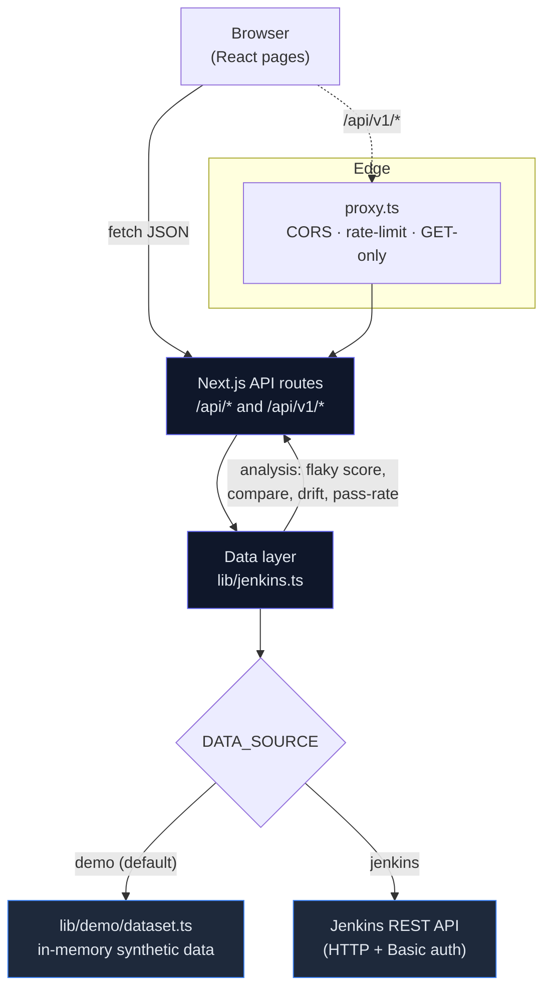
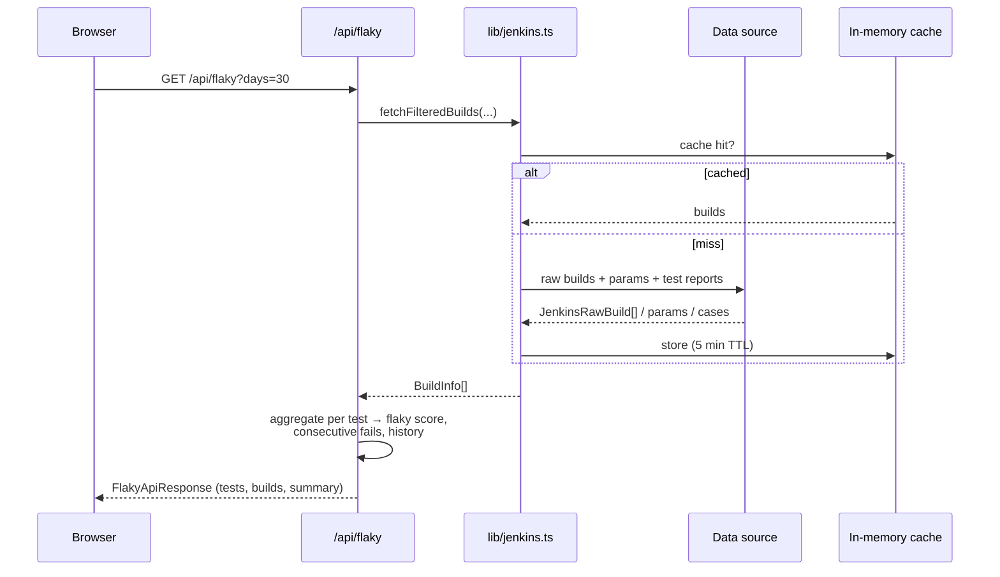
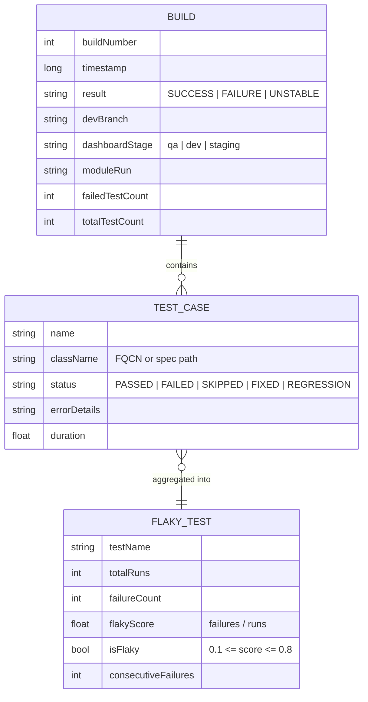
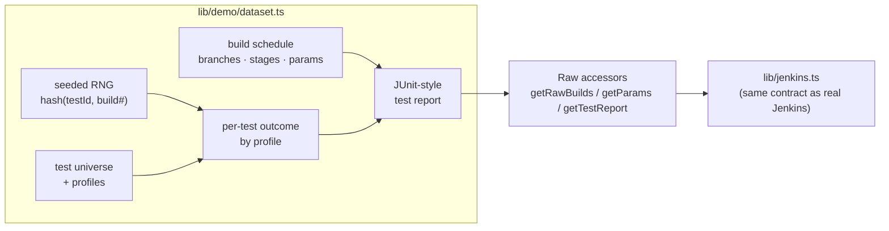

# TestPulse

> **CI Test Intelligence** — turn noisy CI runs into clear signals: flaky-test
> detection, pass-rate trends, stability matrices, build-vs-build comparison,
> and a read-only public API.
> live at : https://testpulseqa.vercel.app/

TestPulse ships with a **built-in synthetic dataset**, so it runs with **zero
external dependencies** — no CI server, no credentials, no network. Everything
you see is generated deterministically in memory and looks like real CI history.

When you're ready for live data, flip a single environment variable
(`DATA_SOURCE=jenkins`) and point it at a real Jenkins — the application code
stays exactly the same.

---

## Table of contents

- [Why TestPulse](#why-testpulse)
- [Features](#features)
- [Screens](#screens)
- [Architecture](#architecture)
- [How a request flows](#how-a-request-flows)
- [The data model](#the-data-model)
- [How the demo data is generated](#how-the-demo-data-is-generated)
- [Project structure](#project-structure)
- [API reference](#api-reference)
- [Getting started](#getting-started)
- [Deploy to Vercel](#deploy-to-vercel)
- [Switching to a real Jenkins](#switching-to-a-real-jenkins)
- [Tech stack](#tech-stack)

---

## Why TestPulse

Large end-to-end / integration suites are noisy. A single flaky test can turn a
green pipeline red and erode trust in CI. TestPulse answers the questions teams
actually ask:

- **Which tests are flaky**, and how badly?
- **Is our pass rate trending up or down** over the last 7 / 15 / 30 days?
- **Did this build introduce a *new* regression**, or is it already-broken noise?
- **Which tests are less stable in one environment than another** (drift)?

---

## Features

| Area | What it does |
| --- | --- |
| **Dashboard** | Summary cards, build-trend chart, and failure insights at a glance. |
| **Flaky Tests** | Per-test flaky score, full run history, and grouped error patterns. |
| **Compare** | Diff two branches/builds — left-only, right-only, and both-failed tests. |
| **Stability Matrix** | Per-test × per-build pass/fail grid to spot patterns fast. |
| **Build History** | Filterable list of recent builds with module, stage, and failure counts. |
| **Drift** | Compare a test's pass rate across environments (e.g. `qa` vs `dev`). |
| **Public API** | Read-only, GET-only JSON API (`/api/v1/*`) for Slack bots and CI gates. |
| **Pass Rate** | Rolling build pass-rate across configurable day windows. |

---

## Screens

Navigate between views from the top nav:

```
Dashboard  ·  Flaky Tests  ·  Compare  ·  Stability Matrix  ·  Build History
```

Plus `/drift`, `/stability`, and full API docs at `/api-docs`.

---

## Architecture

TestPulse is a single Next.js (App Router) application. The UI never talks to a
data source directly — every page calls an internal API route, and every route
funnels through one data layer (`lib/jenkins.ts`). That data layer reads from
either the **demo dataset** or a **real Jenkins**, chosen by an env var.



Key idea: **only four low-level functions** touch the source
(`fetchBranches`, `fetchBuilds`, `fetchBuildParameters`, `fetchTestReport`).
Everything downstream — flaky scoring, comparisons, drift, pass-rate — is shared
and source-agnostic.

---

## How a request flows

Example: loading the **Flaky Tests** page.



Results are cached in-memory (default 5 min TTL) so repeated views and the
public API stay fast.

---

## The data model



A test is classified **flaky** when it both passes and fails within the window
and its failure ratio sits between **10% and 80%** — persistently green tests
aren't flaky, and always-red tests are regressions, not flakes.

---

## How the demo data is generated

`lib/demo/dataset.ts` fabricates a believable CI history:

- **~60 builds** for `master` (plus `develop` and `release-1.9`) spread across
  the last ~35 days, anchored to *now* so the dashboard always looks fresh.
- A **test universe** of ~25 tests across modules (checkout, payments, cart,
  auth, search, reports, …) using realistic Java, Playwright, and pytest names.
- Each test has a **profile**: stable, flaky, a **recent regression**, or a
  **since-fixed** test — so trends, comparisons, and drift all tell a story.
- Outcomes are **deterministic**: derived from a seeded hash of
  `(testId, buildNumber)`, so flaky patterns stay stable across reloads while
  still looking organic.
- Builds carry realistic **parameters** (`DEV_BRANCH`, `TEST_BRANCH`,
  `DASHBOARD_STAGE`, module/regression flags) and occasional stability-test runs.



Because the accessors return the **same shapes** the real Jenkins client
produces, the rest of the app can't tell the difference.

---

## Project structure

```
testpulse/
├─ app/
│  ├─ page.tsx                 # Dashboard
│  ├─ flaky/ compare/ matrix/  # Feature pages
│  ├─ builds/ drift/ stability/
│  ├─ api-docs/                # Public API documentation
│  └─ api/
│     ├─ flaky/ compare/ …     # Internal routes (dashboard)
│     └─ v1/                   # Public, versioned API surface
├─ components/                 # Charts, tables, matrices, nav, loader
├─ lib/
│  ├─ jenkins.ts               # Data layer (demo | jenkins) + analysis
│  ├─ demo/dataset.ts          # Synthetic dataset generator
│  └─ types.ts                 # Shared TypeScript types
├─ proxy.ts                    # Edge middleware for /api/v1 (CORS, rate-limit)
└─ README.md
```

---

## API reference

All endpoints are **GET** and return JSON. The public surface is under
`/api/v1` and documented in-app at **`/api-docs`**.

| Endpoint | Description |
| --- | --- |
| `GET /api/v1/health` | Liveness/version check. |
| `GET /api/v1/flaky` | Top flaky tests (defaults to `top=10`). |
| `GET /api/v1/flaky/test?test=<name>` | History + failure pattern for one test. |
| `GET /api/v1/pass-rate?windows=7,30` | Build pass rate across day windows. |
| `GET /api/v1/compare/baseline?targetId=<n>` | One build vs aggregated master baseline (New / Changed / Pre-existing). |
| `GET /api/v1/compare/builds?leftDev=…&rightDev=…` | Diff failures between two builds/branches. |

Example:

```bash
curl "http://localhost:3000/api/v1/pass-rate?windows=7,30"
```

---

## Getting started

**Prerequisites:** Node.js 18.17+ and npm.

```bash
npm install
npm run dev
```

Open **http://localhost:3000**. No `.env` file is required for the demo — it
serves the built-in dataset out of the box.

Production build:

```bash
npm run build
npm start
```

---

## Deploy to Vercel

1. Push this repository to GitHub.
2. In [vercel.com/new](https://vercel.com/new), **Import** the repo.
3. Framework preset **Next.js** is auto-detected. **No environment variables are
   needed** for the demo.
4. **Deploy** — the first deploy is fully populated because the dataset requires
   no configuration.

---

## Switching to a real Jenkins

Set these variables (in `.env.local` locally, or in Vercel project settings) and
redeploy:

```env
DATA_SOURCE=jenkins
JENKINS_BASE_URL=https://your-jenkins.example.com/job/your-pipeline
JENKINS_USER=your_username
JENKINS_TOKEN=your_api_token
```

The switch lives in `lib/jenkins.ts`: it reads from `lib/demo/dataset.ts` by
default and from the Jenkins REST API when `DATA_SOURCE=jenkins`. Only the four
low-level fetchers change source — all analysis is shared, so no feature code
needs to be touched.

---

## Tech stack

- **Framework:** Next.js 16 (App Router, Turbopack)
- **Language:** TypeScript
- **Styling:** Tailwind CSS v4
- **Charts:** Recharts
- **Icons:** Lucide React

---

<sub>TestPulse is a demo/portfolio project. The default dataset is entirely
synthetic and does not represent any real system or organization.</sub>
